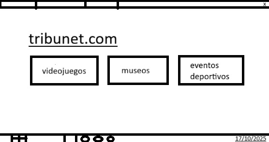

# trebunet.com

La herramienta online para impulsar tus proyectos de programación

**Índice**   
1. [Presentación](#id1)
2. [El Proyecto](#id2)
3. [Instalación](#id3)
4. [Instrucciones operacionales](#id4)
5. [Agradecimientos](#id5)

## Presentación
¡Bienvenido/a al repositorio de Proyecto Trebuchet Gigante! 🛡️

Este README.md es la documentación principal para un ambicioso proyecto centrado en el diseño de un Trebuchet Colosal. Este sistema de lanzamiento es una máquina de alto rendimiento, construida para un solo propósito: la ejecución masiva y ultra-rápida de grandes tareas.

A lo largo de este documento, explorará los siguientes apartados:

Proyecto: Detalles de la arquitectura, los componentes y los modelos de simulación para optimizar el rendimiento.

Instalación: Requisitos de recursos, configuración del entorno y el proceso de montaje del sistema de lanzamiento.

Instrucciones Operacionales: Guías sobre cómo armar, calibrar y ejecutar un lanzamiento con la máxima precisión y eficiencia.

## El Proyecto
Como jóvenes programadores, entendemos la importancia de que nuestros proyectos lleguen a las personas indicadas. Nosotros mismos también intentamos encontrar nuestro lugar en el mundo de la programación, es por ello por lo que, conectar con personas con proyectos similares y fomentar la colaboración de personas de todo el planeta es crucial.
Después de meses de investigación y estudio de interfaces, hemos creado trebunet.com inspirado en el trebuchet medieval, un arma utilizada para lanzar proyectiles pesados contra muros y fortificaciones.

## Instalación

Esta sección explica cómo montar y preparar nuestro Trebuchet Gigante (el sistema de lanzamiento) para su funcionamiento.

### 1. Preparación de la Base (El Entorno)

Antes de hacer nada, necesitamos un lugar firme y estable donde montar la máquina:

1.  Reunir Componentes (Recursos): Asegúrese de tener todos los materiales base: metal, madera y, crucialmente, el Contrapeso (nuestros recursos de potencia).
    * *En el sistema:* Verifique que la máquina (servidor/computadora) tenga la memoria y potencia suficiente para manejar grandes tareas.

### 2. Ensamblaje Central (Instalación del Código Base)

Montamos la estructura principal del Trebuchet:

1.  Construir el Armazón: Montamos las vigas de soporte (instalamos la estructura de carpetas y archivos base del proyecto).
2.  Fijar el Pivote: Colocamos el eje central del Trebuchet (el módulo de ejecución principal). Este debe estar perfectamente alineado para que el brazo gire sin fricción.
3.  Conectar el Contrapeso: Unimos la gran masa de peso al brazo corto.
    * *En el sistema:* Instalamos las dependencias necesarias que dan la "fuerza" al programa.

### 3. Preparación del Brazo (Configuración de la Tarea)

Preparamos el mecanismo que hará el lanzamiento:

1.  Unir el Brazo: Colocamos el largo brazo de lanzamiento sobre el pivote.
2.  Calibrar el Cabestrillo: Ajustamos la bolsa que llevará el proyectil al final del brazo.
    * *En el sistema:* Configuramos la salida, definiendo el formato y el destino final del paquete de datos que vamos a lanzar.

**Listo para Operar:** Una vez completados estos pasos, el sistema está montado y configurado. Consulte las Instrucciones Operacionales para realizar el primer lanzamiento.

## Instrucciones operacionales

Es necesario iniciar sesión y crear tu perfil en tribunet.com especificando, más adelante, tus intereses. De esta forma, el algoritmo puede recomendarte proyectos de otras personas con las que colaborar.

Al abrir sesión, podrás crear tus propias propuesta subiendo tu código html y navegar por las creaciones de miles de jóvenes programasdores de todo el planeta.

## Agradecimientos
Gracias a mis compañeros, que ayudaron a armar y calibrar cada parte de este Trebuchet Gigante con su esfuerzo y sus ideas, y un reconocimiento especial a los profesores, por darnos las herramientas y la guía necesaria para que este proyecto pudiera construirse y, finalmente, lanzar sus proyectiles.